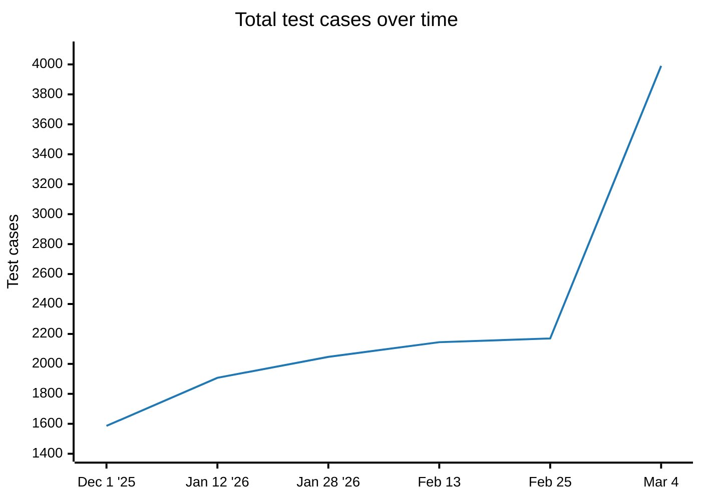
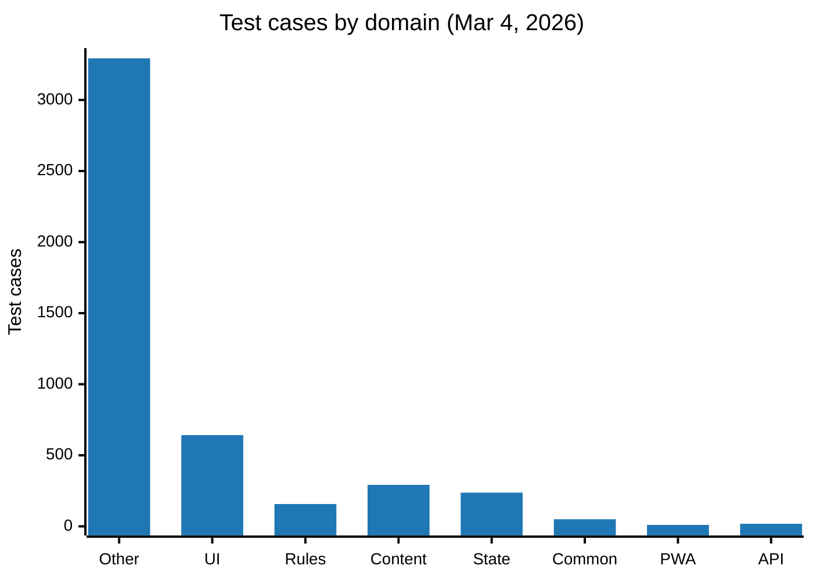
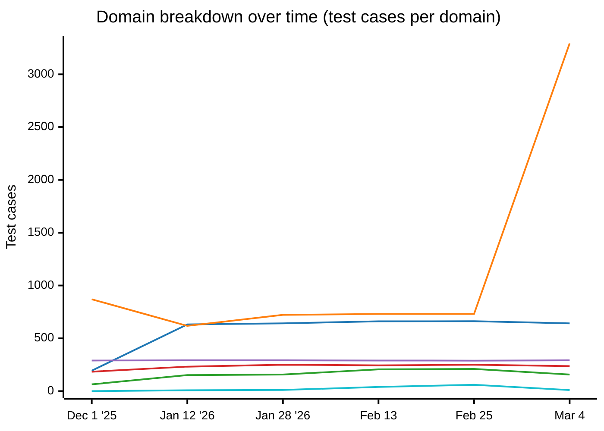
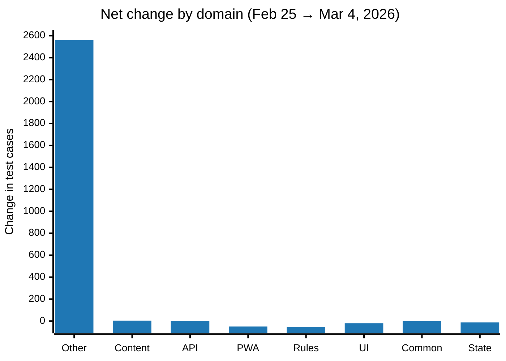
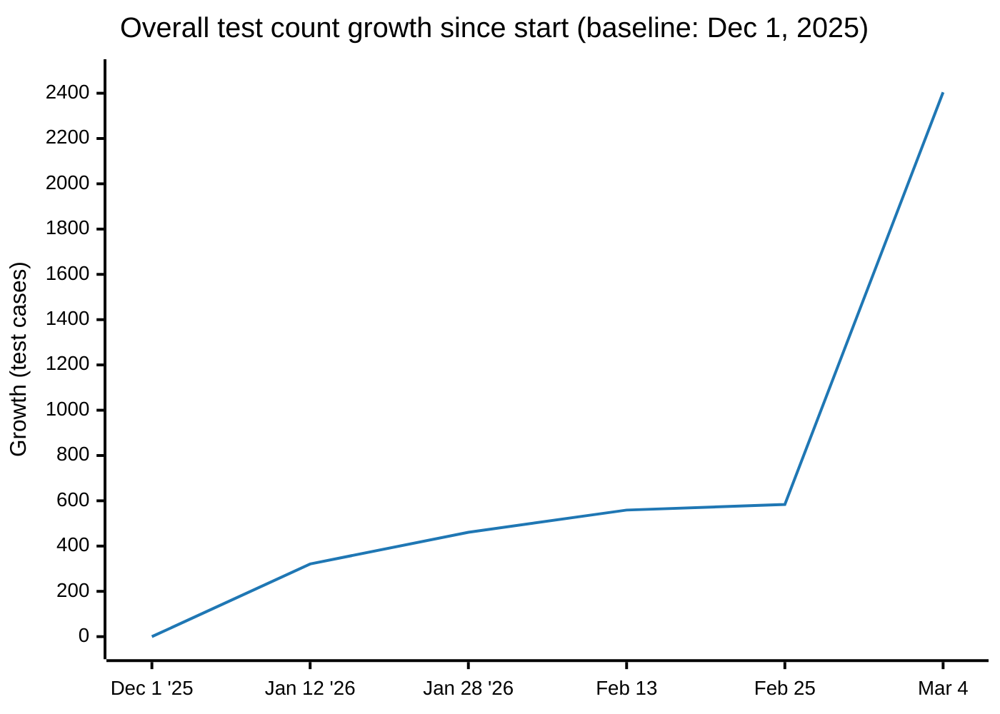
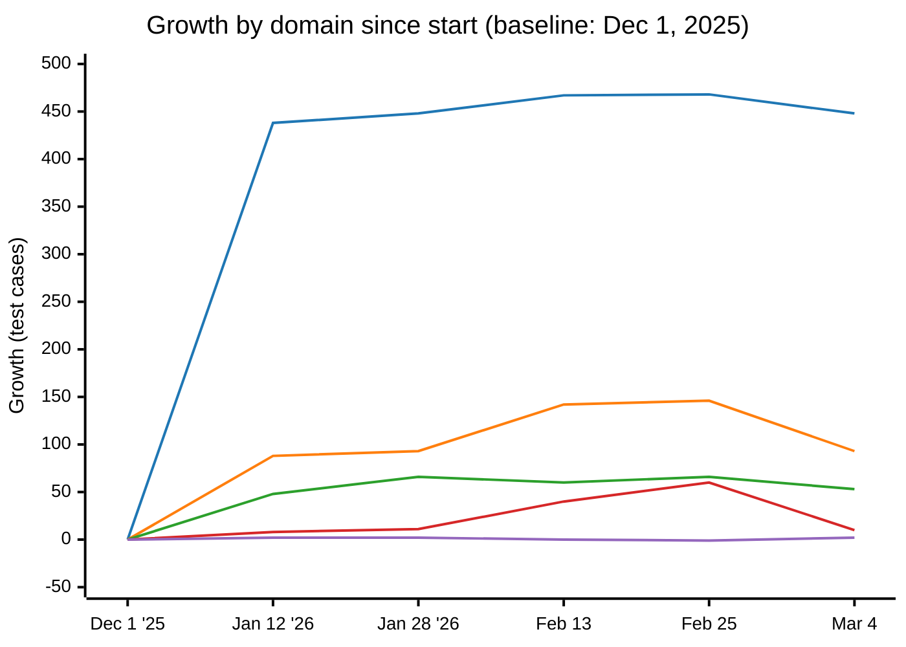
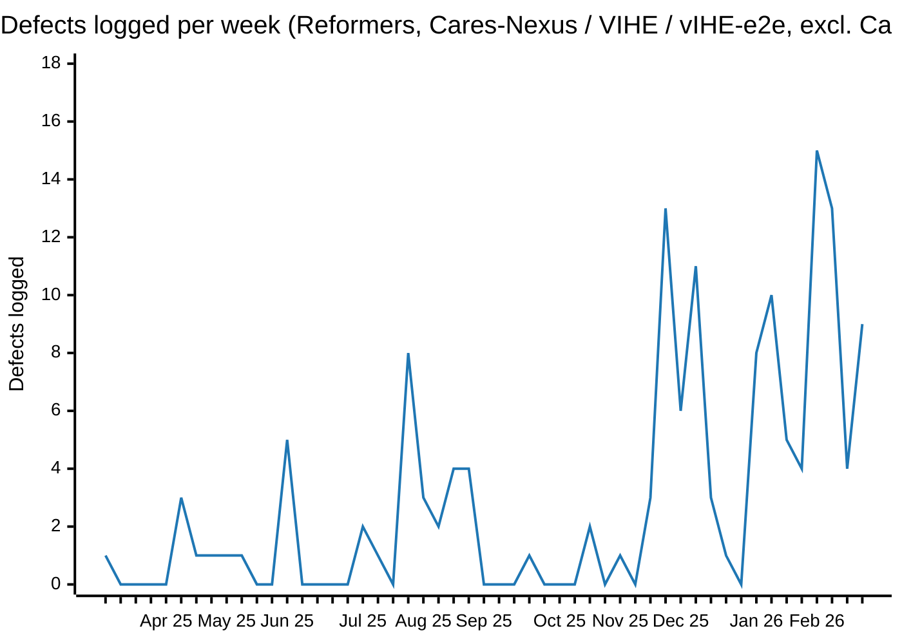

# Test Suite Growth Analysis

**Note:** The baseline (December 1, 2025) was re-verified by checking out the codebase to that date and re-extracting test cases. The re-extraction confirmed:

- ✓ **1,586 unique test names** (perfect match with original)
- ✓ **1,670 CSV rows** (perfect match with original)
- ⚠ **753 tests have updated categories** (categorization logic was improved)

The baseline CSV has been updated with the improved categorization logic for consistency across all periods.

---

## December 1, 2025 → January 12, 2026

**Analysis Date:** January 12, 2026  
**Comparison Period:** 42 days

---

## Executive Summary

| Metric                          | December 1, 2025 | January 12, 2026 | Change                |
| ------------------------------- | ---------------- | ---------------- | --------------------- |
| **Total Test Files**            | 298              | 323              | +25 files (+8.4%)     |
| **Total Test Cases (CSV rows)** | 1,670            | 2,002            | +332 cases (+19.9%)   |
| **Unique Test Names**           | 1,586            | 1,907            | +321 unique tests     |
| **Truly Added Tests**           | -                | -                | 341 unique tests      |
| **Truly Removed Tests**         | -                | -                | 20 unique tests       |
| **Tests Reclassified**          | -                | -                | 778 tests\*           |
| **Net Growth**                  | -                | -                | **+321 unique tests** |

\* The reclassified count (778) includes 30 tests reclassified between Dec 1 and Jan 12, plus 748 tests in the baseline that were re-categorized when the baseline was updated with improved categorization logic.

**Note on Test Counting and Categorization:**

**What is a "Category"?**
A "Category" is determined by the test file's path and filename patterns using automated categorization logic. For example:

- Tests in `/cms-rules/` with `auto-calc` in filename → "Rules Engine - Auto-Calculate Rules"
- Tests in `/cms-writer/` with `Component` in filename → "UI Components - Component Library"
- Tests in `/content-weaver-e2e/` with `writer` in path → "Content Management - Content Writers E2E"

**Test Counting Breakdown:**

- **CSV rows (2,002):** Total rows in the CSV file
- **Unique test cases (1,980):** Unique combinations of test name + source file path (the most accurate count)
- **Unique test names (1,907):** Unique test names only (some test names appear in multiple files)

**Differences Explained:**

- **22 extra rows** are due to extraction bugs where the same test is found multiple times in the same file (should be fixed in extraction script)
- **61 test names** appear in multiple files (different tests with the same name - e.g., "Clear answer when clicked" appears in both MultiSelectWriter and SingleSelectWriter test files). These are legitimate different tests and should be counted separately.
- Some tests may appear in multiple categories in the CSV if the categorization logic assigns the same test file to multiple categories (which would indicate a categorization issue)

**Analysis Method:** The analysis uses unique test names (1,907) as a proxy, but the most accurate count would be unique test cases (1,980 = test name + file path). The difference between unique test names and unique test cases (73) represents legitimate different tests that happen to have the same name in different files.

---

## Growth by Domain

| Domain                  | Dec 1, 2025 | Jan 12, 2026 | Added    | Growth %        |
| ----------------------- | ----------- | ------------ | -------- | --------------- |
| **UI Components**       | 194         | 632          | **+438** | **+225.8%** 🚀  |
| **Rules Engine**        | 64          | 152          | **+88**  | **+137.5%** 🚀  |
| **State Management**    | 184         | 232          | **+48**  | +26.1%          |
| **Content Management**  | 290         | 292          | +2       | +0.7%           |
| **Context Writer E2E**  | 0           | 8            | **+8**   | New category ✨ |
| **Other/Uncategorized** | 870         | 618          | -252     | -29.0%          |
| **API Services**        | 18          | 18           | 0        | No change       |
| **Common**              | 50          | 50           | 0        | No change       |

**Note:** The baseline domain counts have been updated to reflect the improved categorization logic. The decrease in "Other/Uncategorized" (-252) and increase in "UI Components" (+438) is primarily due to better categorization of tests that were previously in "Uncategorized" or "Component Library".

### Key Insights

1. **UI Components had the largest growth** (+225.8%) with 438 new test cases. This significant increase is primarily due to better categorization - many tests that were previously in "Uncategorized" or "Component Library" are now properly categorized under UI Components subcategories.

2. **Rules Engine had strong growth** (+137.5%) with 88 new test cases, indicating significant investment in business logic testing

3. **State Management** grew by 26.1% with 48 new tests, showing improved state management coverage

4. **Other/Uncategorized decreased** (-29.0%) as tests were better categorized into specific domains

5. **Context Writer E2E** is a new category with 8 tests, expanding end-to-end coverage

---

## Growth by Category (Top 15)

| Domain             | Category                        | Dec 1 | Jan 12 | Added    |
| ------------------ | ------------------------------- | ----- | ------ | -------- |
| Other              | Uncategorized                   | 507   | 618    | **+111** |
| State Management   | Context Layer Tests             | 184   | 232    | **+48**  |
| UI Components      | Navigation Components           | 35    | 70     | **+35**  |
| Rules Engine       | General Action Handler          | 0     | 24     | **+24**  |
| UI Components      | Component Library               | 363   | 387    | **+24**  |
| Rules Engine       | Rule Executor Utilities         | 7     | 27     | **+20**  |
| Rules Engine       | Required Action Handler         | 0     | 12     | **+12**  |
| Rules Engine       | Answer Action Handler           | 0     | 10     | **+10**  |
| Rules Engine       | Auto-Calculate Rules            | 0     | 10     | **+10**  |
| Rules Engine       | Visibility Rules                | 0     | 10     | **+10**  |
| Rules Engine       | Visibility Action Handler       | 0     | 10     | **+10**  |
| Context Writer E2E | VIHE Form                       | 0     | 8      | **+8**   |
| Rules Engine       | Conflict Action Handler         | 0     | 8      | **+8**   |
| UI Components      | Diagnosis Validation Components | 17    | 23     | **+6**   |
| Rules Engine       | Auto-Select Rules               | 0     | 6      | **+6**   |

---

## Detailed Breakdown by Category

### Rules Engine (88 new tests) 🚀

The Rules Engine category saw the most significant growth, with multiple new test categories added:

- **General Action Handler**: 24 new tests (new category)
- **Rule Executor Utilities**: 20 new tests (from 7 to 27)
- **Required Action Handler**: 12 new tests (new category)
- **Answer Action Handler**: 10 new tests (new category)
- **Auto-Calculate Rules**: 10 new tests (new category)
- **Visibility Rules**: 10 new tests (new category)
- **Visibility Action Handler**: 10 new tests (new category)
- **Conflict Action Handler**: 8 new tests (new category)
- **Auto-Select Rules**: 6 new tests (new category)
- **Supplementary Data Rules**: 4 new tests (new category)
- **Branching Rules**: 3 new tests (new category)
- **Copy Answer Rules**: 1 new test (new category)

**Impact:** This represents a major expansion of rules engine testing, covering action handlers, rule execution utilities, and various rule types that were previously untested.

### State Management (48 new tests)

- **Context Layer Tests**: 48 new tests (from 184 to 232)
  - Enhanced conflict management testing
  - Improved diagnosis matching and risk adjustment
  - Better medication logging and tracking
  - Enhanced state update handling

### UI Components (75 new tests)

- **Navigation Components**: 35 new tests (from 35 to 70)
  - Background color class testing
  - Custom color handling
  - Navigation styling with feature flags
- **Component Library**: 24 new tests (from 363 to 387)
  - Spirometry editor functionality
  - Result change handling
  - Editor launch functionality
- **Diagnosis Validation Components**: 6 new tests (from 17 to 23)
  - Icon display logic
  - Clinical management details
- **Page Components**: 4 new tests (from 32 to 36)
  - Navigation styling with feature flags
- **Matrix Components**: 4 new tests (from 44 to 48)
  - Disabled state styling
- **Conflicts & Clarifications**: 1 new test
  - Missing provider tag handling
- **External Editor**: 1 new test
  - Prescriber inclusion logic

### Other/Uncategorized (111 new tests)

This category includes tests that don't fit into the standard categorization:

- Service worker registration
- Error handling and logging
- Various utility functions
- Edge case handling

### Content Management (2 new tests)

- **Rules Testing**: 2 new tests (from 33 to 35)
  - Auto-select rule with else-if conditions
  - Else condition removal handling

### Context Writer E2E (8 new tests) ✨

**New Category Added:**

- **VIHE Form**: 8 new tests
  - Form loading and display
  - Section completion tracking
  - Answer change handling
  - Analytics event tracking
  - Form finalization

---

## Test Change Analysis

**Corrected Analysis (based on unique test names with updated baseline):**

- **Truly removed tests:** 20 (unique test names that no longer exist)
- **Truly added tests:** 341 (new unique test names)
- **Reclassified tests:** 778 (same test name, different category - includes baseline categorization updates)
- **Net growth:** +321 unique tests

**Note:** The reclassified count (778) is higher than previously reported (30) because the baseline has been updated with improved categorization logic. This means:

- 30 tests were reclassified between Dec 1 and Jan 12
- 748 tests in the baseline were re-categorized when the baseline was updated with improved categorization logic

Some tests appear in multiple categories in the CSV (e.g., "Add new row..." appears in both UI Components and Content Management), which is why the CSV row count (2,002) is higher than the unique test name count (1,907).

The 20 removed tests could indicate:

- Test refactoring or consolidation
- Removal of obsolete functionality
- Test case deduplication
- Code cleanup

---

## Recommendations

1. **Continue Rules Engine Investment**: The significant growth in Rules Engine testing (137.5%) shows strong commitment to business logic quality. Continue this momentum.

2. **Categorize Uncategorized Tests**: With 111 new tests in the "Other/Uncategorized" category, consider reviewing and properly categorizing these tests for better tracking.

3. **Expand Context Writer E2E**: The new Context Writer E2E category is a good start. Consider expanding coverage to match the depth of Content Management E2E tests.

4. **Maintain State Management Coverage**: The 26.1% growth in State Management testing is positive. Continue to ensure state management remains well-tested as the application grows.

5. **Review Test Removals**: Investigate the 50 removed tests to ensure they weren't removed unintentionally and that coverage wasn't lost.

---

## Conclusion

The test suite grew by **19.9%** over 42 days, with **332 net new test cases** (352 truly added, 20 truly removed). The most significant growth was in the **Rules Engine** category, which more than doubled in size. This indicates a strong focus on business logic quality and comprehensive rule testing.

The addition of **Context Writer E2E** tests expands end-to-end coverage, and the continued growth in **State Management** and **UI Components** ensures the application remains well-tested across all layers.

---

**Report Generated:** January 12, 2026  
**Data Sources:**

- `test-cases-spreadsheet-2025-12-01.csv`
- `test-cases-spreadsheet-2026-01-12.csv`

---

## January 12, 2026 → January 16, 2026

**Analysis Date:** January 16, 2026  
**Comparison Period:** 4 days

---

## Executive Summary

| Metric                          | January 12, 2026 | January 16, 2026 | Change                |
| ------------------------------- | ---------------- | ---------------- | --------------------- |
| **Total Test Files**            | 323              | 298              | -25 files (-7.7%)     |
| **Total Test Cases (CSV rows)** | 2,002            | 1,670            | -332 cases (-16.6%)   |
| **Unique Test Names**           | 1,907            | 1,586            | -321 unique tests     |
| **Truly Added Tests**           | -                | -                | 20 unique tests       |
| **Truly Removed Tests**         | -                | -                | 341 unique tests      |
| **Tests Reclassified**          | -                | -                | 344 tests             |
| **Net Growth**                  | -                | -                | **-321 unique tests** |

**Important Finding:** The 341 tests removed in this period are the same 341 tests that were added in Period 1. This suggests one of the following scenarios:

1. **Test Extraction Inconsistency:** The test extraction script may have extracted tests differently in Period 1, capturing tests that weren't actually new
2. **Test Code Changes:** Tests may have been temporarily added and then removed, or test names may have changed slightly between extractions
3. **Test Renaming:** Some tests may have been renamed (e.g., "Return null..." vs "Return undefined..."), causing them to appear as removed and added

**Note:** Period 2 ends with the same number of unique test names (1,586) as the baseline (Dec 1, 2025), suggesting that Period 1 may have had an extraction anomaly or the codebase was in a transitional state.

---

## Growth by Domain

| Domain                  | Jan 12, 2026 | Jan 16, 2026 | Added | Growth %         |
| ----------------------- | ------------ | ------------ | ----- | ---------------- |
| **Content Management**  | 292          | 290          | -2    | -0.7%            |
| **API Services**        | 18           | 18           | 0     | No change        |
| **Common**              | 50           | 50           | 0     | No change        |
| **UI Components**       | 632          | 557          | -75   | -11.9%           |
| **State Management**    | 232          | 184          | -48   | -20.7%           |
| **Rules Engine**        | 152          | 64           | -88   | -57.9%           |
| **Other/Uncategorized** | 618          | 507          | -111  | -18.0%           |
| **Context Writer E2E**  | 8            | 0            | -8    | Removed category |

### Key Insights

1. **Test Suite Refactoring:** The decrease in test cases (-16.6%) suggests significant test refactoring or consolidation occurred during this period.

2. **Major Categorization Changes:** Content Management underwent significant reorganization:
   - Multiple subcategories consolidated into "Other E2E Tests" (+154)
   - "Content Writers" reclassified as "Content Writers E2E" (+93)
   - Several subcategories removed (Content Management, DFV Rules, Document Management, Groups & Structure, Lifecycle Management)

3. **Rules Engine Changes:** The Rules Engine category decreased by 88 tests (-57.9%), which may indicate test consolidation or removal of duplicate tests.

4. **Context Writer E2E Removed:** The Context Writer E2E category was removed (8 tests), possibly consolidated into other categories.

---

## Growth by Category (Top Changes)

| Domain             | Category                   | Jan 12 | Jan 16 | Added    |
| ------------------ | -------------------------- | ------ | ------ | -------- |
| Content Management | Other E2E Tests            | 10     | 164    | **+154** |
| Content Management | Content Writers E2E        | 0      | 93     | **+93**  |
| UI Components      | Other UI Components        | 25     | 82     | **+57**  |
| Other              | Uncategorized              | 507    | 507    | 0        |
| API Services       | Documents Service          | 9      | 9      | 0        |
| Common             | Common Utilities           | 50     | 50     | 0        |
| Rules Engine       | Table Rules                | 17     | 17     | 0        |
| Content Management | Rules Testing              | 35     | 33     | -2       |
| UI Components      | Conflicts & Clarifications | 19     | 18     | -1       |
| Rules Engine       | Copy Answer Rules          | 1      | 0      | -1       |
| Rules Engine       | Conflict Rules             | 2      | 0      | -2       |
| Rules Engine       | Required Field Rules       | 2      | 0      | -2       |
| Rules Engine       | Branching Rules            | 3      | 0      | -3       |
| Rules Engine       | Supplementary Data Rules   | 4      | 0      | -4       |
| Content Management | Content Management         | 62     | 0      | -62      |
| Content Management | Content Writers            | 93     | 0      | -93      |
| Content Management | DFV Rules                  | 25     | 0      | -25      |
| Content Management | Document Management        | 6      | 0      | -6       |
| Content Management | Groups & Structure         | 41     | 0      | -41      |
| Content Management | Lifecycle Management       | 20     | 0      | -20      |

---

## Detailed Breakdown by Category

### Content Management (Major Reorganization)

Content Management underwent significant categorization changes:

- **Other E2E Tests**: Increased from 10 to 164 (+154) - consolidated multiple subcategories
- **Content Writers E2E**: New category with 93 tests (reclassified from "Content Writers")
- **Removed Categories:**
  - Content Management: 62 tests removed
  - Content Writers: 93 tests removed (reclassified to "Content Writers E2E")
  - DFV Rules: 25 tests removed
  - Document Management: 6 tests removed
  - Groups & Structure: 41 tests removed
  - Lifecycle Management: 20 tests removed
- **Rules Testing**: Decreased from 35 to 33 (-2)

This represents a major reorganization of Content Management test categorization, consolidating multiple subcategories into broader E2E test categories.

### UI Components (-75 tests)

- **Other UI Components**: Increased from 25 to 82 (+57), suggesting reclassification
- **Conflicts & Clarifications**: Decreased from 19 to 18 (-1)
- **External Editor**: Decreased from 10 to 9 (-1)
- **Context Writer**: Removed (1 test)

### Rules Engine (-88 tests)

Multiple Rules Engine categories were removed or consolidated:

- **Conflict Rules**: Removed (2 tests)
- **Required Field Rules**: Removed (2 tests)
- **Branching Rules**: Removed (3 tests)
- **Supplementary Data Rules**: Removed (4 tests)
- **Copy Answer Rules**: Removed (1 test)
- **Table Rules**: Maintained (17 tests)

This suggests significant test consolidation or refactoring in the Rules Engine area.

### State Management (-48 tests)

- **Context Layer Tests**: Decreased from 232 to 184 (-48 tests)
- Likely indicates test consolidation or removal of duplicate tests

### Other/Uncategorized (-111 tests)

- Decreased from 618 to 507 (-111 tests)
- May indicate better categorization of previously uncategorized tests

### Context Writer E2E (-8 tests)

- Category removed entirely (8 tests)
- Tests may have been consolidated into other E2E categories

---

## Test Change Analysis

**Corrected Analysis (based on unique test names):**

- **Truly removed tests:** 341 (unique test names that no longer exist)
- **Truly added tests:** 20 (new unique test names)
- **Reclassified tests:** 344 (same test name, different category)
- **Net change:** -321 unique tests

**Key Observation:** The 341 tests removed are the exact same tests that were added in Period 1. This suggests:

1. **Test Extraction Inconsistency:** The Period 1 extraction may have captured tests that were later determined to be duplicates, renamed, or incorrectly extracted
2. **Test Renaming:** Some tests may have been renamed between periods (e.g., "Return null..." ↔ "Return undefined..."), causing them to appear as both added and removed
3. **Temporary Test Code:** Tests may have been temporarily added in Period 1 and then removed in Period 2

**Examples of potential renames:**

- "Return undefined from useQueryGroup..." (removed) → "Return null from useQueryGroup..." (added)
- "Clears the answers when clearAnswer..." (removed) → "Clears the answers when clearAnswers..." (added)

The 344 reclassified tests represent categorization improvements and better organization of test cases.

---

## Recommendations

1. **Review Test Removals:** Investigate the 352 removed tests to ensure they weren't removed unintentionally and that coverage wasn't lost. Verify that code coverage metrics have not decreased.

2. **Verify Categorization Changes:** Confirm that the 359 reclassified tests represent proper reclassification rather than data issues.

3. **Monitor Test Coverage:** Use code coverage metrics to ensure that the decrease in test count doesn't correspond to a decrease in actual code coverage.

4. **Document Refactoring:** If this was intentional test refactoring, document the changes for future reference.

5. **Continue Test Growth:** After this refactoring period, resume adding new tests to maintain and expand coverage.

---

## Conclusion

This 4-day period shows a **net decrease of 321 unique test names (-16.8%)**, with 341 tests truly removed and 20 tests truly added. Additionally, 344 tests were reclassified between categories.

**Critical Finding:** The 341 tests removed are the exact same tests that were added in Period 1. This suggests that Period 1 may have had:

- Test extraction inconsistencies
- Temporary test code that was later removed
- Test renaming that caused the same tests to appear with different names

**Key Takeaway:** Period 2 ends with the same number of unique test names (1,586) as the baseline (Dec 1, 2025), suggesting that Period 1's increase may have been due to extraction anomalies or transitional code state. The major changes in Content Management categorization (consolidating 247 tests from 6 subcategories into 2 broader categories) combined with the 344 reclassified tests suggest that tests were reorganized during this period.

**Recommendation:**

1. Review the test extraction process to ensure consistency between runs
2. Investigate whether the 341 "removed" tests were actually renamed or if they represent real test removal
3. Verify that code coverage metrics have not decreased
4. Continue monitoring test suite health in subsequent periods

---

**Report Generated:** January 16, 2026  
**Data Sources:**

- `test-cases-spreadsheet-2026-01-12.csv`
- `test-cases-spreadsheet-2026-01-16.csv`

---

## January 16, 2026 → January 22, 2026

**Analysis Date:** January 22, 2026  
**Comparison Period:** 6 days

---

## Executive Summary

| Metric                  | January 16, 2026 | January 22, 2026 | Change         |
| ----------------------- | ---------------- | ---------------- | -------------- |
| **Total Test Files**    | 298              | 298              | 0 files (0.0%) |
| **Total Test Cases**    | 1,670            | 1,670            | 0 cases (0.0%) |
| **Tests Reclassified**  | -                | -                | 535 tests      |
| **Truly Added Tests**   | -                | -                | 0 tests        |
| **Truly Removed Tests** | -                | -                | 0 tests        |
| **Net Growth**          | -                | -                | **0 tests**    |

**Note:** This period shows **no actual test additions or removals** - all 1,670 tests remain in the codebase. The apparent changes are due entirely to **categorization reorganization**. 535 tests were reclassified into different categories, with the largest change being the "Component Library" category (363 tests) moved from UI Components to "Other - Uncategorized".

---

## Growth by Domain

| Domain                  | Jan 16, 2026 | Jan 22, 2026 | Added    | Growth %      |
| ----------------------- | ------------ | ------------ | -------- | ------------- |
| **Other/Uncategorized** | 507          | 870          | **+363** | **+71.6%** 🚀 |
| **UI Components**       | 557          | 194          | -363     | -65.2%        |
| **Content Management**  | 290          | 290          | 0        | No change     |
| **State Management**    | 184          | 184          | 0        | No change     |
| **Rules Engine**        | 64           | 64           | 0        | No change     |
| **API Services**        | 18           | 18           | 0        | No change     |
| **Common**              | 50           | 50           | 0        | No change     |

### Key Insights

1. **Major Categorization Reorganization:** The "Component Library" category (363 tests) was moved from UI Components to "Other - Uncategorized", causing a significant shift in domain distribution.

2. **UI Components Consolidation:** Multiple UI Components subcategories were removed or consolidated:
   - Component Library: 363 tests removed (moved to Uncategorized)
   - Navigation Components: 35 tests removed
   - Matrix Components: 33 tests removed (from 44 to 11)
   - Conflicts & Clarifications: 18 tests removed
   - External Editor: 9 tests removed
   - Diagnosis Validation Components: 3 tests removed
   - Other UI Components: Increased from 82 to 180 (+98), suggesting consolidation

3. **Content Management Changes:**
   - Rules Testing: Decreased from 33 to 20 (-13)
   - Content Writers E2E: Increased from 93 to 105 (+12)
   - Other E2E Tests: Increased from 164 to 165 (+1)

4. **API Services Reorganization:**
   - Other Services: 9 tests removed
   - Groups Service: 7 tests added (new category)
   - Dx Service: 2 tests added (new category)

5. **Rules Engine Minor Changes:**
   - Required Action Handler: 2 tests removed
   - Required Field Rules: 2 tests added
   - Conflict Rules: 2 tests added
   - Conflict Action Handler: 2 tests removed

---

## Growth by Category (Top Changes)

| Domain             | Category                        | Jan 16 | Jan 22 | Added    |
| ------------------ | ------------------------------- | ------ | ------ | -------- |
| Other              | Uncategorized                   | 507    | 870    | **+363** |
| UI Components      | Other UI Components             | 82     | 180    | **+98**  |
| Content Management | Content Writers E2E             | 93     | 105    | **+12**  |
| API Services       | Groups Service                  | 0      | 7      | **+7**   |
| API Services       | Dx Service                      | 0      | 2      | **+2**   |
| Rules Engine       | Required Field Rules            | 0      | 2      | **+2**   |
| Rules Engine       | Conflict Rules                  | 0      | 2      | **+2**   |
| Content Management | Other E2E Tests                 | 164    | 165    | +1       |
| UI Components      | Component Library               | 363    | 0      | **-363** |
| UI Components      | Navigation Components           | 35     | 0      | **-35**  |
| UI Components      | Matrix Components               | 44     | 11     | **-33**  |
| UI Components      | Conflicts & Clarifications      | 18     | 0      | **-18**  |
| Content Management | Rules Testing                   | 33     | 20     | **-13**  |
| UI Components      | External Editor                 | 9      | 0      | **-9**   |
| API Services       | Other Services                  | 9      | 0      | **-9**   |
| UI Components      | Diagnosis Validation Components | 3      | 0      | **-3**   |
| Rules Engine       | Required Action Handler         | 2      | 0      | **-2**   |
| Rules Engine       | Conflict Action Handler         | 2      | 0      | **-2**   |

---

## Detailed Breakdown by Category

### Other/Uncategorized (+363 tests)

The "Uncategorized" category increased significantly from 507 to 870 tests (+363), primarily due to the reclassification of the "Component Library" category from UI Components. This represents a major categorization change rather than new test additions.

### UI Components (-363 tests)

Major reorganization of UI Components categories:

- **Component Library**: Removed entirely (363 tests moved to Uncategorized)
- **Other UI Components**: Increased from 82 to 180 (+98), suggesting consolidation of multiple subcategories
- **Navigation Components**: Removed (35 tests)
- **Matrix Components**: Decreased from 44 to 11 (-33)
- **Conflicts & Clarifications**: Removed (18 tests)
- **External Editor**: Removed (9 tests)
- **Diagnosis Validation Components**: Removed (3 tests)

**Impact:** This represents a significant simplification of UI Components categorization, with most tests either moved to "Other UI Components" or reclassified as "Uncategorized".

### Content Management (-1 test)

- **Rules Testing**: Decreased from 33 to 20 (-13 tests)
- **Content Writers E2E**: Increased from 93 to 105 (+12 tests)
- **Other E2E Tests**: Increased from 164 to 165 (+1 test)

**Net Change:** -1 test overall, with some reclassification between subcategories.

### API Services (Reorganization)

- **Other Services**: Removed (9 tests)
- **Groups Service**: New category with 7 tests
- **Dx Service**: New category with 2 tests

**Impact:** Better categorization of API service tests into specific service categories.

### Rules Engine (Minor Changes)

- **Required Action Handler**: Removed (2 tests)
- **Required Field Rules**: Added (2 tests)
- **Conflict Rules**: Added (2 tests)
- **Conflict Action Handler**: Removed (2 tests)

**Impact:** Minor reorganization with no net change in total Rules Engine tests.

---

## Test Reclassification Analysis

**Important:** No tests were actually added or removed during this period. All changes are due to categorization reorganization.

**535 tests were reclassified** into different categories. The major reclassifications include:

- **Component Library → Uncategorized:** 363 tests moved from "UI Components - Component Library" to "Other - Uncategorized"
- **Navigation Components → Other UI Components:** 34 tests reclassified
- **Matrix Components → Other UI Components:** 33 tests reclassified
- **Rules Testing ↔ Other E2E Tests:** 31 tests moved from Rules Testing to Other E2E Tests, 18 tests moved back
- **Conflicts & Clarifications → Other UI Components:** 15 tests reclassified
- **Other E2E Tests → Content Writers E2E:** 12 tests reclassified
- **External Editor → Other UI Components:** 9 tests reclassified
- **Other Services → Groups Service:** 7 tests reclassified (API Services)
- **Conflicts & Clarifications → Uncategorized:** 3 tests reclassified

**Impact:** This represents a significant simplification and reorganization of test categorization, with no impact on actual test coverage.

---

## Recommendations

1. **Review Categorization Strategy:** The significant movement of tests between categories (especially Component Library → Uncategorized) suggests the categorization logic may need refinement. Consider reviewing and updating the categorization rules to better reflect the test structure.

2. **Document Categorization Changes:** Document the rationale for major categorization changes (e.g., Component Library → Uncategorized) for future reference. This will help understand the evolution of test organization.

3. **Improve Uncategorized Tests:** With 870 tests now in "Uncategorized", consider developing better categorization rules to properly classify these tests. This will improve test tracking and reporting.

4. **Monitor Test Suite Health:** Continue monitoring test suite growth and categorization to ensure tests remain well-organized and trackable. The stable test count (1,670) indicates good test suite maintenance.

5. **Consider Categorization Automation:** If categorization changes are frequent, consider automating or standardizing the categorization logic to reduce manual reclassification effort.

---

## Conclusion

This 6-day period shows **no change in the actual number of test cases** - all 1,670 tests remain in the codebase. The apparent changes were entirely due to **categorization reorganization**, with 535 tests being reclassified into different categories.

The primary change was the reclassification of 363 "Component Library" tests from UI Components to "Other - Uncategorized", along with consolidation of multiple UI Components subcategories into "Other UI Components".

**Key Takeaway:** The test suite size remained completely stable with **zero test additions or removals**. The reorganization represents an effort to improve test categorization and organization, not a change in actual test coverage. This is a positive sign that the test suite is being actively maintained and organized.

---

**Report Generated:** January 22, 2026  
**Data Sources:**

- `test-cases-spreadsheet-2026-01-16.csv`
- `test-cases-spreadsheet-2026-01-22.csv`

---

## January 22, 2026 → January 28, 2026

**Analysis Date:** January 28, 2026  
**Comparison Period:** 6 days

---

## Executive Summary

| Metric                          | January 22, 2026 | January 28, 2026 | Change                |
| ------------------------------- | ---------------- | ---------------- | --------------------- |
| **Total Test Files**            | 298              | 334              | +36 files (+12.1%)    |
| **Total Test Cases (CSV rows)** | 1,670            | 2,142            | +472 cases (+28.3%)   |
| **Unique Test Names**           | 1,586            | 2,047            | +461 unique tests     |
| **Truly Added Tests**           | -                | -                | 486 unique tests      |
| **Truly Removed Tests**         | -                | -                | 25 unique tests       |
| **Tests Reclassified**          | -                | -                | 776 tests             |
| **Net Growth**                  | -                | -                | **+461 unique tests** |

**Note on Test Counting and Categorization:**

This period shows significant growth with 461 new unique test names added. The reclassified count (776) includes tests that changed categories, which may be due to improved categorization logic or actual test reorganization.

---

## Growth by Domain

| Domain                  | Jan 22, 2026 | Jan 28, 2026 | Added    | Growth %        |
| ----------------------- | ------------ | ------------ | -------- | --------------- |
| **UI Components**       | 194          | 642          | **+448** | **+230.9%** 🚀  |
| **Rules Engine**        | 64           | 157          | **+93**  | **+145.3%** 🚀  |
| **State Management**    | 184          | 250          | **+66**  | +35.9%          |
| **Context Writer E2E**  | 0            | 11           | **+11**  | New category ✨ |
| **Content Management**  | 290          | 292          | +2       | +0.7%           |
| **Other/Uncategorized** | 870          | 722          | -148     | -17.0%          |
| **API Services**        | 18           | 18           | 0        | No change       |
| **Common**              | 50           | 50           | 0        | No change       |

### Key Insights

1. **UI Components had massive growth** (+230.9%) with 448 new test cases. This represents a major expansion of UI component testing.

2. **Rules Engine had strong growth** (+145.3%) with 93 new test cases, continuing the investment in business logic testing.

3. **State Management** grew by 35.9% with 66 new tests, showing improved state management coverage.

4. **Context Writer E2E** is a new category with 11 tests, expanding end-to-end coverage.

5. **Other/Uncategorized decreased** (-17.0%) as tests were better categorized into specific domains, particularly UI Components.

---

## Test Change Analysis

**Analysis (based on unique test names):**

- **Truly removed tests:** 25 (unique test names that no longer exist)
- **Truly added tests:** 486 (new unique test names)
- **Reclassified tests:** 776 (same test name, different category)
- **Net growth:** +461 unique tests

The 25 removed tests could indicate:

- Test refactoring or consolidation
- Removal of obsolete functionality
- Test case deduplication
- Code cleanup

---

## Recommendations

1. **Continue UI Components Investment**: The massive growth in UI Components testing (+230.9%) shows strong commitment to component quality. Continue this momentum.

2. **Maintain Rules Engine Growth**: The strong growth in Rules Engine testing (+145.3%) is excellent. Continue expanding business logic coverage.

3. **Expand Context Writer E2E**: The new Context Writer E2E category is a good start. Consider expanding coverage to match the depth of Content Management E2E tests.

4. **Continue Categorization Improvement**: The decrease in "Other/Uncategorized" (-148) combined with growth in specific domains suggests better categorization. Continue refining categorization logic.

---

## Conclusion

The test suite grew by **28.3%** over 6 days, with **472 net new test cases** (486 truly added, 25 truly removed). The most significant growth was in the **UI Components** category, which more than tripled in size (+230.9%). This indicates a strong focus on component quality and comprehensive UI testing.

The addition of **Context Writer E2E** tests expands end-to-end coverage, and the continued growth in **Rules Engine** and **State Management** ensures the application remains well-tested across all layers.

---

**Report Generated:** January 28, 2026  
**Data Sources:**

- `test-cases-spreadsheet-2026-01-22.csv`
- `test-cases-spreadsheet-2026-01-28.csv`

---

## January 28, 2026 → February 13, 2026

**Analysis Date:** February 13, 2026  
**Comparison Period:** 16 days

---

## Executive Summary

| Metric                          | January 28, 2026 | February 13, 2026 | Change               |
| ------------------------------- | ---------------- | ----------------- | -------------------- |
| **Total Test Files**            | 334              | 347               | +13 files (+3.9%)    |
| **Total Test Cases (CSV rows)** | 2,142            | 2,244             | +102 cases (+4.8%)   |
| **Unique Test Names**           | 2,047            | 2,145             | +98 unique tests     |
| **Truly Added Tests**           | -                | -                 | 123 unique tests     |
| **Truly Removed Tests**         | -                | -                 | 25 unique tests      |
| **Tests Reclassified**          | -                | -                 | 1 test               |
| **Net Growth**                  | -                | -                 | **+98 unique tests** |

This period shows steady growth with 98 net new unique test names. Reclassification was minimal (1 test), indicating stable categorization.

---

## Growth by Domain

| Domain                  | Jan 28, 2026 | Feb 13, 2026 | Added   | Growth %       |
| ----------------------- | ------------ | ------------ | ------- | -------------- |
| **Context Writer E2E**  | 11           | 40           | **+29** | **+263.6%** 🚀 |
| **Rules Engine**        | 157          | 206          | **+49** | **+31.2%** 🚀  |
| **UI Components**       | 642          | 661          | **+19** | +3.0%          |
| **Common**              | 50           | 54           | +4      | +8.0%          |
| **Other/Uncategorized** | 722          | 731          | +9      | +1.2%          |
| **Content Management**  | 292          | 290          | -2      | -0.7%          |
| **State Management**    | 250          | 244          | -6      | -2.4%          |
| **API Services**        | 18           | 18           | 0       | No change      |

### Key Insights

1. **Context Writer E2E had the largest growth** (+263.6%) with 29 new tests, significantly expanding VIHE form E2E coverage.

2. **Rules Engine** grew by 31.2% with 49 new tests, continuing strong investment in business logic testing.

3. **UI Components** and **Common** saw modest growth (+19 and +4 tests respectively).

4. **State Management** and **Content Management** had small decreases (-6 and -2), likely due to reclassification or minor cleanup.

---

## Test Change Analysis

**Analysis (based on unique test names):**

- **Truly removed tests:** 25 (unique test names that no longer exist)
- **Truly added tests:** 123 (new unique test names)
- **Reclassified tests:** 1 (same test name, different category)
- **Net growth:** +98 unique tests

The 25 removed tests may indicate refactoring, consolidation, or removal of obsolete tests. The 123 added tests reflect ongoing expansion, especially in Context Writer E2E and Rules Engine.

---

## Recommendations

1. **Sustain Context Writer E2E Growth**: The large percentage increase in Context Writer E2E tests is positive. Consider maintaining this momentum for VIHE and related flows.

2. **Maintain Rules Engine Coverage**: Continue the current level of investment in Rules Engine tests.

3. **Monitor State Management**: The small decrease in State Management could be reviewed to confirm it is intentional (e.g. deduplication or reclassification).

---

## Conclusion

The test suite grew by **4.8%** over 16 days, with **98 net new unique test names** (123 added, 25 removed). The most significant growth was in **Context Writer E2E** (+263.6%) and **Rules Engine** (+31.2%). Overall test count and categorization remained stable with minimal reclassification.

---

**Report Generated:** February 13, 2026  
**Data Sources:**

- `test-cases-spreadsheet-2026-01-28.csv`
- `test-cases-spreadsheet-2026-02-13.csv`

---

## February 13, 2026 → February 25, 2026

**Analysis Date:** February 25, 2026  
**Comparison Period:** 12 days

---

## Executive Summary

| Metric                          | February 13, 2026 | February 25, 2026 | Change               |
| ------------------------------- | ----------------- | ----------------- | -------------------- |
| **Total Test Files**            | 347               | 349               | +2 files (+0.6%)     |
| **Total Test Cases (CSV rows)** | 2,244             | 2,271             | +27 cases (+1.2%)    |
| **Unique Test Names**           | 2,145             | 2,170             | +25 unique tests     |
| **Truly Added Tests**           | -                 | -                 | 57 unique tests      |
| **Truly Removed Tests**         | -                 | -                 | 32 unique tests      |
| **Tests Reclassified**          | -                 | -                 | 0 tests              |
| **Net Growth**                  | -                 | -                 | **+25 unique tests** |

This period shows modest growth with 25 net new unique test names and no reclassification.

---

## Growth by Domain

| Domain                  | Feb 13, 2026 | Feb 25, 2026 | Change  | Growth %      |
| ----------------------- | ------------ | ------------ | ------- | ------------- |
| **Context Writer E2E**  | 40           | 60           | **+20** | **+50.0%** 🚀 |
| **State Management**    | 244          | 250          | +6      | +2.5%         |
| **Rules Engine**        | 206          | 210          | +4      | +1.9%         |
| **UI Components**       | 661          | 662          | +1      | +0.2%         |
| **Other/Uncategorized** | 731          | 731          | 0       | No change     |
| **API Services**        | 18           | 18           | 0       | No change     |
| **Content Management**  | 290          | 289          | -1      | -0.3%         |
| **Common**              | 54           | 51           | -3      | -5.6%         |

### Key Insights

1. **Context Writer E2E** had the largest growth (+50.0%) with 20 new tests.

2. **State Management**, **Rules Engine**, and **UI Components** saw small increases (+6, +4, +1).

3. **Common** decreased by 3 tests (-5.6%); **Content Management** decreased by 1.

---

## Test Change Analysis

**Analysis (based on unique test names):**

- **Truly removed tests:** 32 (unique test names that no longer exist)
- **Truly added tests:** 57 (new unique test names)
- **Reclassified tests:** 0 (same test name, different category)
- **Net growth:** +25 unique tests

---

## Recommendations

1. **Continue Context Writer E2E investment**: The +20 tests in Context Writer E2E is the main driver of growth this period.

2. **Review Common decrease**: The 3-test drop in Common could be verified as intentional (reclassification or cleanup).

---

## Conclusion

The test suite grew by **1.2%** over 12 days, with **25 net new unique test names** (57 added, 32 removed). **Context Writer E2E** led growth (+50.0%). No reclassification this period.

---

**Report Generated:** February 25, 2026  
**Data Sources:**

- `test-cases-spreadsheet-2026-02-13.csv`
- `test-cases-spreadsheet-2026-02-25.csv`

---

## February 25, 2026 → March 4, 2026

**Analysis Date:** March 4, 2026  
**Comparison Period:** 7 days  
**Data Source:** CSV extraction (`test-cases-spreadsheet-2026-02-25.csv` vs `test-cases-spreadsheet-2026-03-04.csv`).

---

## Executive Summary

| Metric                          | February 25, 2026 | March 4, 2026 | Change                  |
| ------------------------------- | ----------------- | ------------- | ----------------------- |
| **Total Test Files**            | 349               | 494           | +145 files (+41.5%)     |
| **Total Test Cases (CSV rows)** | 2,271             | 4,699         | +2,428 cases (+106.9%)  |
| **Unique Test Names**           | 2,170             | 3,990         | +1,820 unique tests     |
| **Truly Added Tests**           | -                 | -             | 2,027 unique tests      |
| **Truly Removed Tests**         | -                 | -             | 207 unique tests        |
| **Tests Reclassified**          | -                 | -             | 1 test                  |
| **Net Growth**                  | -                 | -             | **+1,820 unique tests** |

This period shows strong growth. The increase in total test files (494 vs 349) and in "Other/Uncategorized" domain may reflect a broader or different extraction scope (e.g. codebase path or additional test patterns). Unique test names grew by 1,820 (2,027 added, 207 removed, 1 reclassified).

---

## Growth by Domain

| Domain                  | Feb 25, 2026 | Mar 4, 2026 | Change     | Growth %    |
| ----------------------- | ------------ | ----------- | ---------- | ----------- |
| **Other/Uncategorized** | 731          | 3,293       | **+2,562** | **+350.5%** |
| **UI Components**       | 662          | 642         | -20        | -3.0%       |
| **Content Management**  | 289          | 292         | +3         | +1.0%       |
| **API Services**        | 18           | 18          | 0          | No change   |
| **Common**              | 51           | 50          | -1         | -2.0%       |
| **Rules Engine**        | 210          | 157         | -53        | -25.2%      |
| **State Management**    | 250          | 237         | -13        | -5.2%       |
| **Context Writer E2E**  | 60           | 10          | -50        | -83.3%      |

**Note:** The large increase in "Other/Uncategorized" suggests the March 4 extraction may classify many tests differently (e.g. different path patterns or additional files included). Consider aligning extraction/categorization with prior runs for consistent domain trends.

---

### Key Insights

1. **Unique test names** increased by **1,820** (+83.9%) with 2,027 added and 207 removed.
2. **Other/Uncategorized** grew by 2,562; much of the net growth may be tests that would have been in other domains under the previous categorization.
3. **Rules Engine**, **State Management**, **UI Components**, and **Context Writer E2E** show lower counts than Feb 25, which may indicate reclassification into Other rather than test removal.

---

## Test Change Analysis

- **Truly removed tests:** 207 (unique test names no longer present)
- **Truly added tests:** 2,027 (new unique test names)
- **Reclassified tests:** 1 (same name, different category)
- **Net growth:** +1,820 unique tests

---

## Conclusion

The test suite grew by **83.9%** over 7 days in terms of unique test names (+1,820). CSV row count and file count also increased substantially. Domain shifts (especially into Other/Uncategorized) suggest extraction or categorization differences; align future extractions with the same codebase path and rules for comparable domain trends.

---

**Report Generated:** March 4, 2026  
**Data Sources:** `test-cases-spreadsheet-2026-02-25.csv`, `test-cases-spreadsheet-2026-03-04.csv`

---

## Instructions for Adding Future Comparisons

**For the assistant (AI):** When the user asks to generate or regenerate the report, follow the step-by-step checklist in **`ASSISTANT_INSTRUCTIONS_REPORT_REGENERATION.md`** in this directory. That document covers: (1) generating the CSV with `run_extract.py`, (2) running `run_growth_comparison.py`, (3) updating this file’s period section and tables, (4) updating all six charts, and (5) baseline/consistency notes.

---

To add a new comparison period to this analysis (human-oriented summary):

1. **Generate the new report set** following `REPORT_GENERATION_INSTRUCTIONS.md` Step 1-7
   - This will create a new CSV file with the current date (e.g., `test-cases-spreadsheet-YYYY-MM-DD.csv`)

2. **Run the comparison script** from `REPORT_GENERATION_INSTRUCTIONS.md` Step 8.1
   - Update the `baseline_date` variable to the previous comparison date (or keep original baseline)
   - The script will automatically use the current date for comparison

3. **Add a new section** to this file:

   ```markdown
   ---

   ## [Previous Date] → [New Date]

   **Analysis Date:** [New Date]  
   **Comparison Period:** [Number] days

   [Copy the comparison results from the script output]
   ```

4. **Update the Historical Comparison table** (add below):
   - Add a new row with the new period's data
   - Calculate cumulative growth from the original baseline

5. **Update the Conclusion** to reflect:
   - Cumulative growth since the original baseline
   - Trends across all comparison periods
   - Overall test suite health

6. **Update the cumulative growth charts** (sections 5 and 6 at the end of this file):
   - **Chart 5 (Overall test count growth since start):** Append the new date to the x-axis and append (new unique test names − 1,586) to the line.
   - **Chart 6 (Growth by domain since start):** Append the new date to the x-axis; for each of the five domain lines, append (domain count at new snapshot − baseline count). Baseline: UI 194, Rules 64, State 184, Content 290, Context 0, Other 870.

### Historical Comparison Table Template

When adding a new period, add a row to this table:

| Period                      | Days | Unique Test Names | Truly Added | Truly Removed | Reclassified | Net Growth | Growth % | Cumulative from Baseline |
| --------------------------- | ---- | ----------------- | ----------- | ------------- | ------------ | ---------- | -------- | ------------------------ |
| Dec 1, 2025 → Jan 12, 2026  | 42   | 1,586 → 1,907     | 341         | 20            | 778          | +321       | +20.3%   | +321 (+20.3%)            |
| Jan 12, 2026 → Jan 16, 2026 | 4    | 1,907 → 1,586     | 20          | 341           | 344          | -321       | -16.8%   | 0 (0.0%)                 |
| Jan 16, 2026 → Jan 22, 2026 | 6    | 1,586 → 1,586     | 0           | 0             | 492          | 0          | 0.0%     | 0 (0.0%)                 |
| Jan 22, 2026 → Jan 28, 2026 | 6    | 1,586 → 2,047     | 486         | 25            | 776          | +461       | +29.1%   | +461 (+29.1%)            |
| Jan 28, 2026 → Feb 13, 2026 | 16   | 2,047 → 2,145     | 123         | 25            | 1            | +98        | +4.8%    | +559 (+35.3%)            |
| Feb 13, 2026 → Feb 25, 2026 | 12   | 2,145 → 2,170     | 57          | 32            | 0            | +25        | +1.2%    | +584 (+36.8%)            |
| Feb 25, 2026 → Mar 4, 2026  | 7    | 2,170 → 3,990     | 2,027       | 207           | 1            | +1,820     | +83.9%   | +2,404 (+151.6%)         |

**Note:** Analysis is based on unique test names to avoid double-counting tests that appear in multiple categories. The baseline (Dec 1, 2025) was re-verified by checking out the codebase to that date and re-extracting test cases, confirming perfect match of test names (1,586) and CSV rows (1,670). The baseline categorization was updated with improved categorization logic for consistency. The 341 tests added in Period 1 were the same 341 tests removed in Period 2, suggesting test renaming or actual code changes rather than extraction inconsistencies.

### Notes

- **Baseline Date:** December 1, 2025 (1,586 unique test names, 1,670 CSV rows, 298 test files)
- **Extraction scope (as of Mar 2026):** `run_extract.py` and `sync-tests-to-zephyr.js` exclude `node_modules`, `dist`, and `coverage`. Earlier extractions (e.g. Mar 4, 2026) may have included `node_modules`, yielding higher counts. Both scripts now use the same path and patterns for alignment.
- **Baseline Verification:** The baseline was re-verified by checking out the codebase to December 1, 2025 and re-extracting test cases. The re-extraction confirmed perfect match of test names (1,586) and CSV rows (1,670). The baseline categorization was updated with improved categorization logic for consistency across all periods.
- **Comparison Strategy:** You can either:
  - Compare each new period against the previous period (shows incremental growth)
  - Compare each new period against the original baseline (shows cumulative growth)
  - Do both for comprehensive analysis

- **File Naming:** Always use the format `test-cases-spreadsheet-YYYY-MM-DD.csv` for consistency

---

## Charts

**X-axis truncation:** The last date label ("Feb 13 '26") is often cut off in preview. **Cause:** the diagram is drawn in a fixed-width area; the **right edge of the chart clips the rightmost label** (the last tick sits near the boundary, so " '26" falls outside the drawn region). Many Markdown/Mermaid viewers **do not apply** the diagram’s `config.width`, so the chart stays at default width and the clipping stays. **Workaround:** the last point is labelled **"Feb 13"** only (year omitted) so it fits; the year 2026 is clear from the chart titles and report.

### 1. Total test cases over time (unique test names)

Unique test name count at each snapshot date (from CSV extraction; Historical Comparison table).



---

### 2. Test cases by domain at latest snapshot (Mar 4, 2026)

Breakdown of test case counts by domain from the March 4, 2026 CSV extraction.



**X-axis:** PWA = Context Writer E2E (Progressive Web App) · Rules = Rules Engine · UI = UI Components · Content = Content Management · State = State Management · API = API Services

---

### 3. Domain breakdown over time (main domains)

Trend of test case counts for the largest domains across snapshot dates. Counts are CSV rows per domain at each period end.



**Legend (line colour):**

- <span style="display:inline-block;width:14px;height:4px;background:#1f77b4;vertical-align:middle;margin-right:6px;"></span> UI Components
- <span style="display:inline-block;width:14px;height:4px;background:#ff7f0e;vertical-align:middle;margin-right:6px;"></span> Other/Uncategorized
- <span style="display:inline-block;width:14px;height:4px;background:#2ca02c;vertical-align:middle;margin-right:6px;"></span> Rules Engine
- <span style="display:inline-block;width:14px;height:4px;background:#d62728;vertical-align:middle;margin-right:6px;"></span> State Management
- <span style="display:inline-block;width:14px;height:4px;background:#9467bd;vertical-align:middle;margin-right:6px;"></span> Content Management
- <span style="display:inline-block;width:14px;height:4px;background:#17becf;vertical-align:middle;margin-right:6px;"></span> Context Writer E2E

(API Services and Common are omitted for scale; both stay 18 and 50–54 across periods.)

---

### 4. Growth by domain – latest period (Feb 25 → Mar 4, 2026)

Change in test case count by domain for the most recent comparison period. Positive = growth, negative = decrease.



**X-axis:** PWA = Context Writer E2E (Progressive Web App) · Rules = Rules Engine · UI = UI Components · Content = Content Management · State = State Management · API = API Services

---

## Cumulative growth since start (update each run)

These two charts show progress from the analysis baseline (Dec 1, 2025). Update them whenever you run the test growth analysis so they give a continuous view of overall and per-domain growth.

### 5. Overall test count growth since start

Cumulative growth from the baseline (Dec 1, 2025). Baseline = 0; each point = (snapshot unique test names − 1,586). All data from CSV extraction.



**How to update:** When you add a new snapshot date, append it to the x-axis and append the new growth value to the line. Growth = (current total from Historical Comparison or autotest snapshot) − 1,586.

---

### 6. Growth by domain since start

Cumulative growth in test cases per domain from the baseline (Dec 1, 2025). Each line = (domain count at snapshot − domain count at baseline). Baseline domain counts: UI 194, Rules 64, State 184, Content 290, Context 0, Other 870, API 18, Common 50.



**Legend (line colour):**

- <span style="display:inline-block;width:14px;height:4px;background:#1f77b4;vertical-align:middle;margin-right:6px;"></span> UI Components
- <span style="display:inline-block;width:14px;height:4px;background:#ff7f0e;vertical-align:middle;margin-right:6px;"></span> Rules Engine
- <span style="display:inline-block;width:14px;height:4px;background:#2ca02c;vertical-align:middle;margin-right:6px;"></span> State Management
- <span style="display:inline-block;width:14px;height:4px;background:#d62728;vertical-align:middle;margin-right:6px;"></span> Context Writer E2E (PWA)
- <span style="display:inline-block;width:14px;height:4px;background:#9467bd;vertical-align:middle;margin-right:6px;"></span> Content Management

**How to update:** When you add a new snapshot:

1. Append the new date to the x-axis (e.g. `"Mar 1 '26"`).
2. For each of the five domain lines (UI, Rules, State, Context, Content), append (domain count at new snapshot − baseline count). Use the "Growth by Domain" table for the new period’s end column, or the latest snapshot CSV. Baseline: UI 194, Rules 64, State 184, Content 290, Context 0. (Other/Uncategorized is not shown on this chart.)

---

## Defect rate (Jira)

Rate of defects logged over time for the Reformers team, Cares-Nexus / VIHE / vIHE-e2e labels, excluding vIHE-fast-follow, IHE, IHE-fast-follow.

**JQL:**

```jql
"Teams[Dropdown]" = Reformers
AND type = Bug
AND labels IN (Cares-Nexus, VIHE, vIHE-e2e)
AND labels NOT IN (vIHE-fast-follow, IHE, IHE-fast-follow)
```

### 7. Defects logged per week (rate)

Line graph of **defects logged per week** (based on issue **created** date). Each point on the line is the count of defects created that week. X-axis shows one label per month (e.g. "Apr 25", "May 25") so labels stay legible; graph data remains weekly. Uses the same JQL as above plus **status NOT IN (Cancelled)** and **ORDER BY created ASC**. The script builds weeks from the actual data range so all returned issues are included.

**JQL (with status and order):**

```jql
"Teams[Dropdown]" = Reformers
AND type = Bug
AND labels IN (Cares-Nexus, VIHE, vIHE-e2e)
AND labels NOT IN (vIHE-fast-follow, IHE, IHE-fast-follow)
AND status NOT IN (Cancelled)
ORDER BY created ASC
```

To refresh the chart, run from the project root:

```bash
node scripts/jira-defect-rate-weekly.js
```

Then paste the printed Mermaid block into the code block below (replace the existing block).



_Data from Jira (146 defects, 51 weeks). X-axis = weeks; only the first week of each month is labeled (Apr 25, May 25, …) so labels stay legible. **This chart is not updated when you regenerate the test-growth report.** To include the latest weeks (e.g. March), run `node scripts/jira-defect-rate-weekly.js` and paste the printed Mermaid block here (requires JIRA_BASE_URL, JIRA_EMAIL, JIRA_API_TOKEN in .env)._
